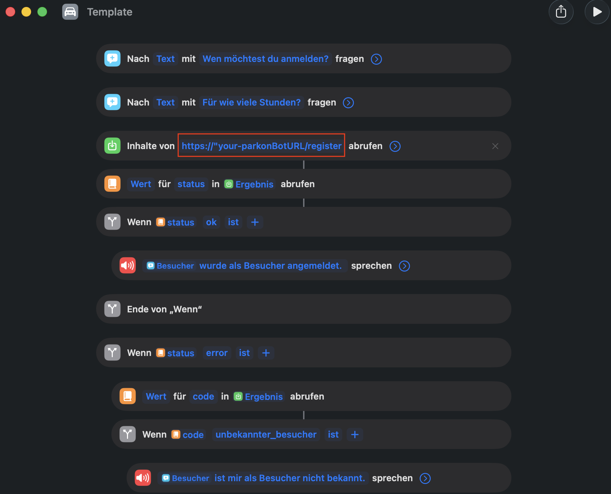

# Parkon-Bot 🚗💨

----------

## Introduction

**Parkon-Bot** is an automation tool designed to eliminate the hassle 
of manually registering visitor cars on Parkon-controlled parking lots. 
Parkon is a service that monitors visitor parking spaces and issues fines 
to vehicles not registered through their web form.

This bot automates the entire registration process. From looking up license plates 
to filling out the web form using a headless browser. All this is triggered by a simple Siri 
command. Additionally, it monitors your active sessions and sends reminders 
before they expire, ensuring you never accidentally receive a fine because 
you forgot to extend your visitors parking.

----------

## Key Features

-**Siri Integration**: Register a visitor simply by speaking to Siri via Apple Shortcuts.

-**Automatic Lookup**: Automatically retrieves car details (canton and license plate) from Firestore based on the visitor's name.

-**Browser Automation**: Uses Playwright to navigate the Parkon website and fill out the form automatically.

-**Duration Parsing**: A helper utility translates spoken or typed duration text (e.g., "für zwei Stunden") into the numerical format required by the portal.

-**Interactive Notifications**: Sends alerts via ntfy.sh 2 hours before a session expires with a "Verlängern" (Extend) button for instant renewal.

-**Automatic Cleanup**: Deletes session records older than 30 days to maintain database health.

----------

## How It Works

### 1. Registration Flow
  1. **Trigger**: An Apple Shortcut sends a POST request to the `/register` endpoint with the visitor's `name` and `duration_text` after interacting with Siri.
 

  2. **Database Lookup**: The bot retrieves the visitor's car information from the `Besucher`collection in Firestore after parsing the `duration_text`.
     - Error Handling: If the visitor is not found in the database or the registration failed,
       the bot returns an error message and Siri will inform you accordingly.
    
        

  3. **Automation**: The `register_car` helper launches a headless Chromium browser via Playwright to fill out the Parkon form.
  4. **Session Logging**: A new entry is created in the `Sessions`collection, calculating the `startTime`and `endTime`.
     Siri will inform you on successful registration and Parkon will send the confirmation to your mail.
    
      

### 2. Monitoring & Renewal
  1. **Expiration Check**: A Cloud Scheduler periodically triggers the `/check` endpoint.

  2. **Notification**: If a session expires within the next 2 hours, a push notification is sent via `ntfy`.
     
     

  4. **Renewal**: Tapping "Verlängern" on the notification sends a new request to `/register`to start a new session for that visitor with the same duration.

     

### 3. Maintenance
  1. **Cleanup**: A Cloud Scheduler triggers the `cleanup`endpoint to every month to delete records older than 30 days from Firestore.

----------
  
## Launch & Deployment

### Prerequisites
- Python 3.10+ installed on your machine
- Google Cloud Project with Firestore enabled (Native Mode)
- ntfy app installed on your IPhone
- gcloud CLI installed (optional, for deployment)
- Docker (optional, for containerized deployment)

### Local Setup

1. **Download and Install**
```
# Clone the repository
git clone https://github.com/ermin-mumic/parkon-bot.git
cd parkon-bot

# Create virtual environment
python -m venv venv
source venv/bin/activate   # Mac/Linux or venv\Scripts\activate on Windows

# Install Python requirements
pip install -r requirements.txt

# Install Playwright browsers and dependencies
playwright install --with-deps chromium
```
2. **Connect Firestore**
The bot uses a Service Account to securely talk to your database.
   1. Go to IAM & Admin > Service Accounts in your Google Cloud Console
   2. Create a service account with the Cloud Datastore User role
   3. Generate a JSON Key and rename it to `service-account.json`
   4. Place this file in a folder named `/keys`at the root of your project. This folder is already ignored by Git

3. **Database Setup**
In your Firestore console, manually create the following:
  - Collection: `Besucher` (here is where you add all your visitors information)
    1. Create document(s) named after a person (e.g., Max)
    2. Add a field `name` (String)
    3. Add a field `cars`(Array)
    4. Add object(s) to the array:
    ```
    {
    "kanton": "ZH",
    "kennzeichen": "123456"
    }
    ```

- Collection: `Sessions` will be created automtically by the bot.

4. **Environment Variables**
You can set them in your terminal or in a `.env` file:
```
export PARKON_URL="https://your-parkon-link.ch"
export CONFIRMATION_EMAIL="your-email@example.com"
export NTFY_TOPIC="your-private-topic"
# for ntfy notifications to work PUBLIC_URL must be publicly reachable
export PUBLIC_URL="http://localhost:8080" 
export GOOGLE_APPLICATION_CREDENTIALS="keys/service-account.json"
```
- PARKON_URL: The URL of the parking form.
- CONFIRMATION_EMAIL: Where Parkon sends confirmation receipts.
- NTFY_TOPIC: Your unique topic for push notifications.
- PUBLIC_URL: Address of your bot.

5. **Run the Bot**
```
python -m uvicorn app:app --host 0.0.0.0 --port 8080
```

### Siri & ntfy Configuration
This allows you to receive notifications and interact with Siri for an automated registration process.

1. Setup ntfy
   1. create a new subscription to the same topic you set in `NTFY_TOPIC`
  
2. Setup Siri Shortcut
  1. Download the [shortcut template](assets/shortcuts/Template.shortcut) with your IPhone
  2. Import it into the Shortcuts app and edit the shortcut
  3. Change the title of the Shortcut from "Template" to something you want Siri to react when saying "Hey Siri, x" (e.g., "Melde einen Besucher an")
  4. Add your `PUBLIC_URL/register` to step 3 in the shortcut (e.g., `http://localhost:8080`for local or your cloud URL)

     

### Deployment on Google Cloud Run

1. **Install and authenticate gcloud**
   
   - if not installed: `https://cloud.google.com/sdk/docs/install`
  
```
gcloud auth login
gcloud config set project YOUR_PROJECT_ID

# verify
gcloud config list
```
2. **Enable Required APIs**

```
gcloud services enable \
  run.googleapis.com \
  cloudbuild.googleapis.com \
  firestore.googleapis.com \
  cloudscheduler.googleapis.com
```

3. **Build and Push Docker Image**
From the project root:
```
gcloud builds submit --tag gcr.io/YOUR_PROJECT_ID/parkon-bot
```

4. **Deploy to Cloud Run**
```
gcloud run deploy parkon-bot \
  --image gcr.io/YOUR_PROJECT_ID/parkon-bot \
  --region europe-west6 \
  --platform managed \
  --allow-unauthenticated
```

- After deployment you receive a `PUBLIC_URL`

5. **Configure Environment Variables in Cloud Run**

- Add all environment variables as in Step 4 of the Local Setup in Cloud Run Console

6. **Create Cloud Scheduler Jobs**
In your Google Cloud Console > Cloud Scheduler

- create a scheduler with your `PUBLIC_URL/check` for every minute (this way it also keeps an instance warm all the time)

- create a scheduler with your `PUBLIC_URL/cleanup`for every first of a month

----------

## Technology Stack

- **Language**: Python 3.10+ - Core Programming
- **Framework**: FastAPI - Web API
- **Browser Automation**: Playwright - Headless browser for form submission
- **Database**: Google Cloud Firestore - NoSQL storage
- **Deployment**: Docker - Containerization
- **Notification**: ntfy Notification service via Google Cloud Scheduler

----------

> **_NOTE:_**  This project is for personal automation. Ensure usage complies with the parking provider's terms of service.


