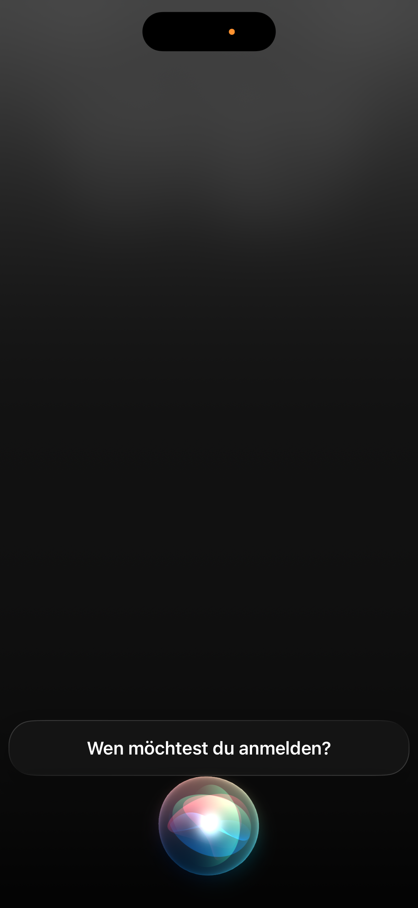
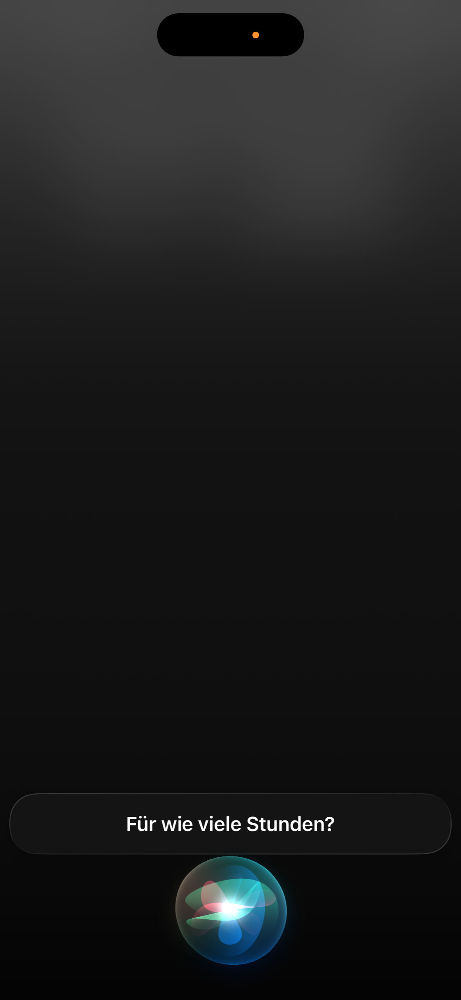
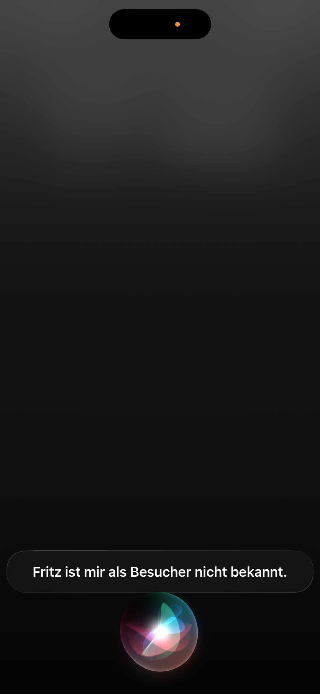
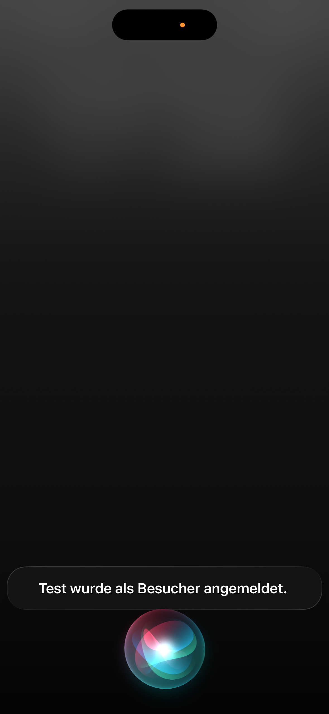
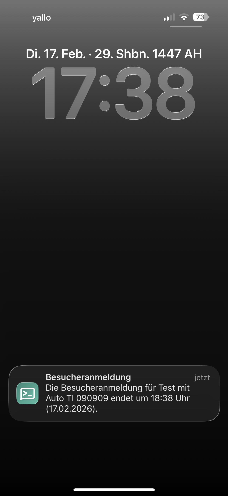
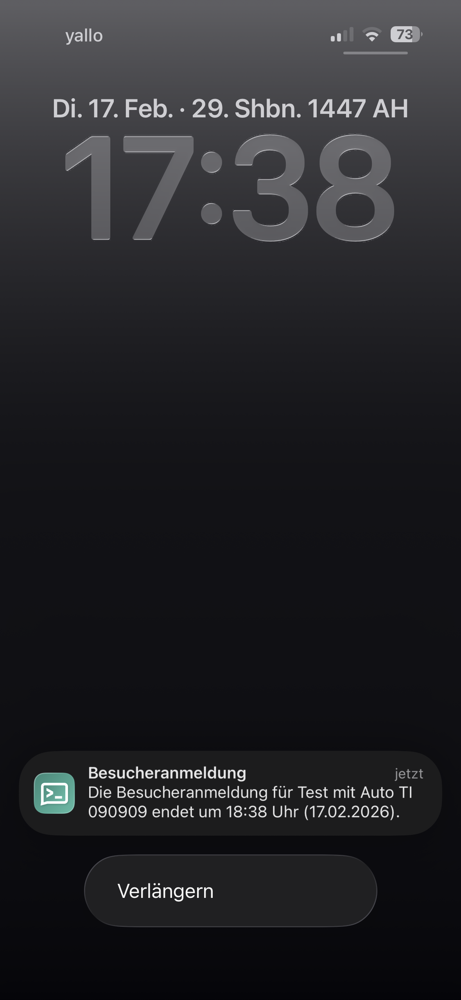

# Parkon-Bot 🚗💨

----------

## Introduction

**Parkon-Bot** is an automation tool designed to eliminate the hassle 
of manually registering visitor cars on Parkon-controlled parking lots. 
Parkon is a service that monitors visitor parking spaces and issues fines 
to vehicles not registered through their web form.

This bot automates the entire registration process. From looking up license plates 
to filling out the web form using a headless browser. All this is triggered by a simple Siri 
command. Additionally, it monitors your active sessions and sends reminders 
before they expire, ensuring you never accidentally receive a fine because 
you forgot to extend your visitors parking.

----------

## Key Features

-**Siri Integration**: Register a visitor simply by speaking to Siri via Apple Shortcuts.

-**Automatic Lookup**: Automatically retrieves car details (canton and license plate) from Firestore based on the visitor's name.

-**Browser Automation**: Uses Playwright to navigate the Parkon website and fill out the form automatically.

-**Duration Parsing**: A helper utility translates spoken or typed duration text (e.g., "für zwei Stunden") into the numerical format required by the portal.

-**Interactive Notifications**: Sends alerts via ntfy.sh 2 hours before a session expires with a "Verlängern" (Extend) button for instant renewal.

-**Automatic Cleanup**: Deletes session records older than 30 days to maintain database health.

----------

## How It Works

### 1. Registration Flow
  1. **Trigger**: An Apple Shortcut sends a POST request to the `/register` endpoint with the visitor's `name` and `duration_text` after interacting with Siri.
 

  2. **Database Lookup**: The bot retrieves the visitor's car information from the `Besucher`collection in Firestore after parsing the `duration_text`.
     - Error Handling: If the visitor is not found in the database or the registration failed,
       the bot returns an error message and Siri will inform you accordingly.
    
        

  3. **Automation**: The `register_car` helper launches a headless Chromium browser via Playwright to fill out the Parkon form.
  4. **Session Logging**: A new entry is created in the `Sessions`collection, calculating the `startTime`and `endTime`.
     Siri will inform you on successful registration and Parkon will send the confirmation to your mail.
    
      

### 2. Monitoring & Renewal
  1. **Expiration Check**: A Cloud Scheduler periodically triggers the `/check` endpoint.

  2. **Notification**: If a session expires within the next 2 hours, a push notification is sent via `ntfy`.
     
     

  4. **Renewal**: Tapping "Verlängern" on the notification sends a new request to `/register`to start a new session for that visitor with the same duration.

     

### 3. Maintenance
  1. **Cleanup**: A Cloud Scheduler triggers the `cleanup`endpoint to every month to delete records older than 30 days from Firestore.

----------
  
## Launch & Deployment
